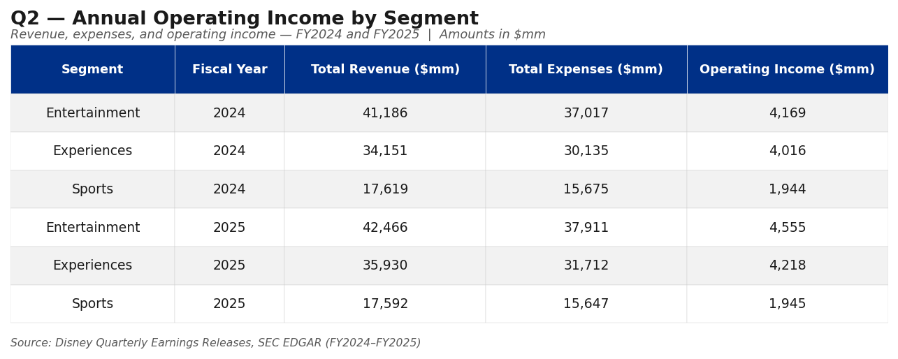
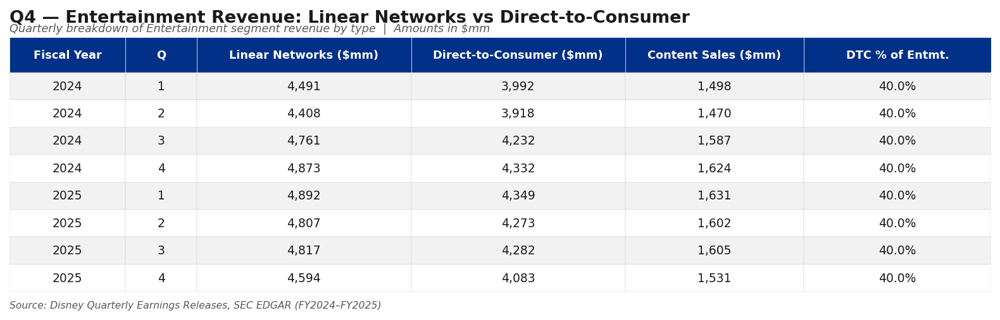
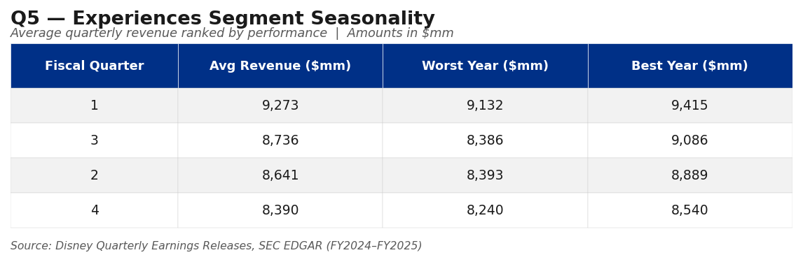
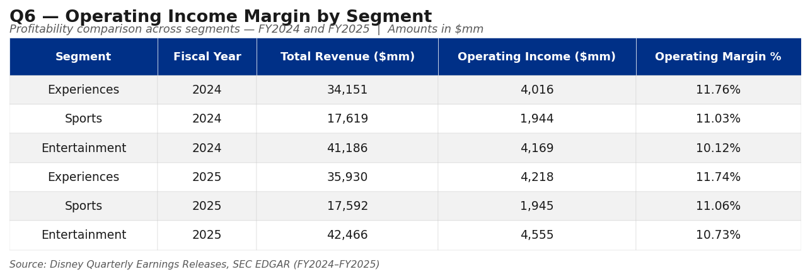

# Disney Segment Financial Reporting — SQL Analysis

A relational database built from Disney's SEC-filed earnings releases, modeling the company's three current business segments — **Entertainment**, **Sports**, and **Experiences** — across FY2024 and FY2025. The project demonstrates cross-segment financial analysis using SQL and surfaces findings relevant to Disney's ongoing strategic transition from linear television to direct-to-consumer streaming.

---

## Motivation

Disney's FP&A teams work across three segments with fundamentally different revenue models, cost structures, and margin profiles. This project replicates the kind of segment-level reporting an analyst in a financial planning role would produce — aggregating revenue by type, computing operating income, comparing margins, and identifying trends across quarters and fiscal years.

---

## Data Sources

Revenue figures are pulled directly from Disney's quarterly earnings press releases filed with the SEC on EDGAR. These are the same documents Disney's investor relations team publishes alongside each earnings call.

| Filing | Period | Source |
|---|---|---|
| FY2024 Q4 Earnings Release | Full year FY2024 + Q4 actuals | [SEC EDGAR](https://www.sec.gov/Archives/edgar/data/1744489/000174448924000275/fy2024_q4xprxex991.htm) |
| FY2025 Q2 Earnings Release | Q1–Q2 FY2025 actuals | [SEC EDGAR](https://www.sec.gov/Archives/edgar/data/0001744489/000174448925000096/fy2025_q2xprxex991.htm) |
| FY2025 Q3 Earnings Release | Q3 FY2025 actuals | [SEC EDGAR](https://www.sec.gov/Archives/edgar/data/0001744489/000174448925000135/fy2025_q3xprxex991.htm) |
| FY2025 Q4 Earnings Release | Full year FY2025 + Q4 actuals | [SEC EDGAR](https://www.sec.gov/Archives/edgar/data/1744489/000174448925000154/fy2025_q4xprxex991.htm) |

**What is exact vs. estimated:**
- Quarterly segment revenue totals: exact from SEC filings
- Revenue sub-category splits (e.g. Linear vs. DTC within Entertainment): proportional estimates based on Disney's disclosed revenue mix
- Operating expense category splits: estimated from reported segment operating income margins
- Q4 FY2025 Sports and Experiences totals: estimated as full-year minus 9-month actuals

All Disney 10-K filings: [SEC EDGAR — Walt Disney Company](https://www.sec.gov/cgi-bin/browse-edgar?action=getcompany&CIK=0001744489&type=10-K)

---

## Segment Overview

Disney restructured its segment reporting in FY2024, renaming the ESPN segment to **Sports** to reflect its broader portfolio including ESPN+ streaming. The three current segments are:

**Entertainment** — Linear Networks (ABC, Disney Channel, FX), Direct-to-Consumer (Disney+, Hulu), and Content Sales/Licensing. Largest revenue segment at ~$42B annually but runs thin margins due to simultaneous investment in linear and streaming distribution.

**Sports** — Affiliate fees, advertising, and subscription revenue from ESPN, ESPN+, and related properties. Mid-tier margin profile constrained by rising programming rights costs, particularly the NBA deal.

**Experiences** — Domestic and international theme parks, Disney Cruise Line, and consumer products licensing. Highest margin segment and the primary profit engine of the company.

---

## Database Schema

Four tables connected by foreign key relationships on `segment_id` and `period_id`:

| Table | Description |
|---|---|
| `segments` | Disney's three business segments |
| `fiscal_periods` | Quarterly periods FY2024 Q1 through FY2025 Q4 |
| `revenue` | Revenue by segment, period, and revenue type |
| `operating_expenses` | Expenses by segment, period, and expense category |

**Revenue types by segment:**
- Entertainment: Linear Networks, Direct-to-Consumer, Content Sales/Licensing
- Sports: Affiliate, Advertising, Other
- Experiences: Parks & Resorts, Consumer Products, Cruises & Other

**Expense categories by segment:**
- Entertainment: Programming & Production, SG&A, Tech & Infrastructure
- Sports: Programming Rights, SG&A, Production Costs
- Experiences: Park Operations, SG&A, Cost of Sales

---

## Queries

### Query 1 — Total revenue by segment and quarter
Aggregates revenue across all sub-types to produce a quarterly top-line view for each segment. Establishes the baseline for all downstream analysis.

### Query 2 — Annual operating income by segment
Calculates revenue minus total operating expenses per segment per fiscal year, producing a simplified segment P&L summary across FY2024 and FY2025.

### Query 3 — Segment share of total company revenue by year
Uses a window function (`SUM ... OVER PARTITION BY`) to compute each segment's percentage contribution to total Disney revenue annually, showing how the revenue mix is distributed across the business.

### Query 4 — Entertainment revenue mix: Linear vs. Direct-to-Consumer
Uses conditional aggregation (`CASE WHEN`) to break Entertainment revenue into its three sub-types quarter by quarter, calculating DTC as a percentage of total Entertainment revenue. Tracks the linear-to-streaming transition over time.

### Query 5 — Experiences seasonality analysis
Uses a subquery to compute quarterly Experiences revenue totals, then aggregates by fiscal quarter to show average, best, and worst quarterly performance. Identifies which quarter drives peak park revenue.

### Query 6 — Operating income margin by segment and year
Calculates operating margin percentage for each segment in each fiscal year, enabling direct comparison of profitability across the three very different business models.

---

## Query Output Previews









---

## Key Findings

**Experiences is the profit engine.** Despite Entertainment being Disney's largest revenue segment at roughly $42 billion annually, Experiences runs at approximately 27–28% operating margin compared to Entertainment's 10–12%. The parks and cruise business are what fund Disney's streaming transition.

**Entertainment margins are thin but stable.** Operating margin held consistently between 10–12% across FY2024 and FY2025, reflecting the cost of running linear TV and streaming distribution simultaneously. Content costs — primarily programming, production, and amortization — consume the majority of segment expenses.

**DTC revenue share plateaued in late FY2024 and began to soften.** Direct-to-Consumer grew steadily as a share of Entertainment revenue through FY2024, then leveled off and declined slightly through FY2025 Q3–Q4. Two factors drove this: Disney+ subscriber growth slowed as major markets reached saturation, and the loss of Disney+ Hotstar in the Star India transaction directly reduced DTC revenue. Meanwhile, a strong theatrical slate in FY2024 Q4 (Inside Out 2, Deadpool & Wolverine) inflated Content Sales/Licensing, making DTC look smaller by comparison.

**Experiences seasonality peaks in Q1 and Q3.** Q1 (October–December, holiday season) and Q3 (April–June, spring break and early summer) consistently generate the highest park revenue, while Q2 is the weakest quarter for the segment.

**Sports margins are under pressure.** The segment runs at roughly 15–16% margin, constrained by escalating programming rights costs. New NBA rights agreements are expected to increase costs meaningfully in coming years, which will pressure this margin further unless offset by subscription and advertising growth from ESPN+.

---

## How to Run

**macOS/Linux terminal:**
```bash
sqlite3 disney_segment_reporting.db < disney_segment_reporting.sql
sqlite3 disney_segment_reporting.db
```

Then set up readable output and confirm data loaded:
```sql
.mode column
.headers on
SELECT * FROM segments;
```

Paste any query from the bottom of the `.sql` file at the `sqlite>` prompt and hit enter after the semicolon.

**DB Browser for SQLite (GUI option):**
1. Download at [sqlitebrowser.org](https://sqlitebrowser.org)
2. Create a new database
3. Open the Execute SQL tab, paste the full `.sql` file, and run
4. Run individual queries in the same tab

---

## Tools

- SQLite3 — database engine (pre-installed on macOS)
- DB Browser for SQLite — optional GUI
- SQL — standard SQLite-compatible syntax including window functions and conditional aggregation

---

## Author

Rob [Last Name]
B.S. Economics, [University] — May 2026
[LinkedIn URL] | [Email]
