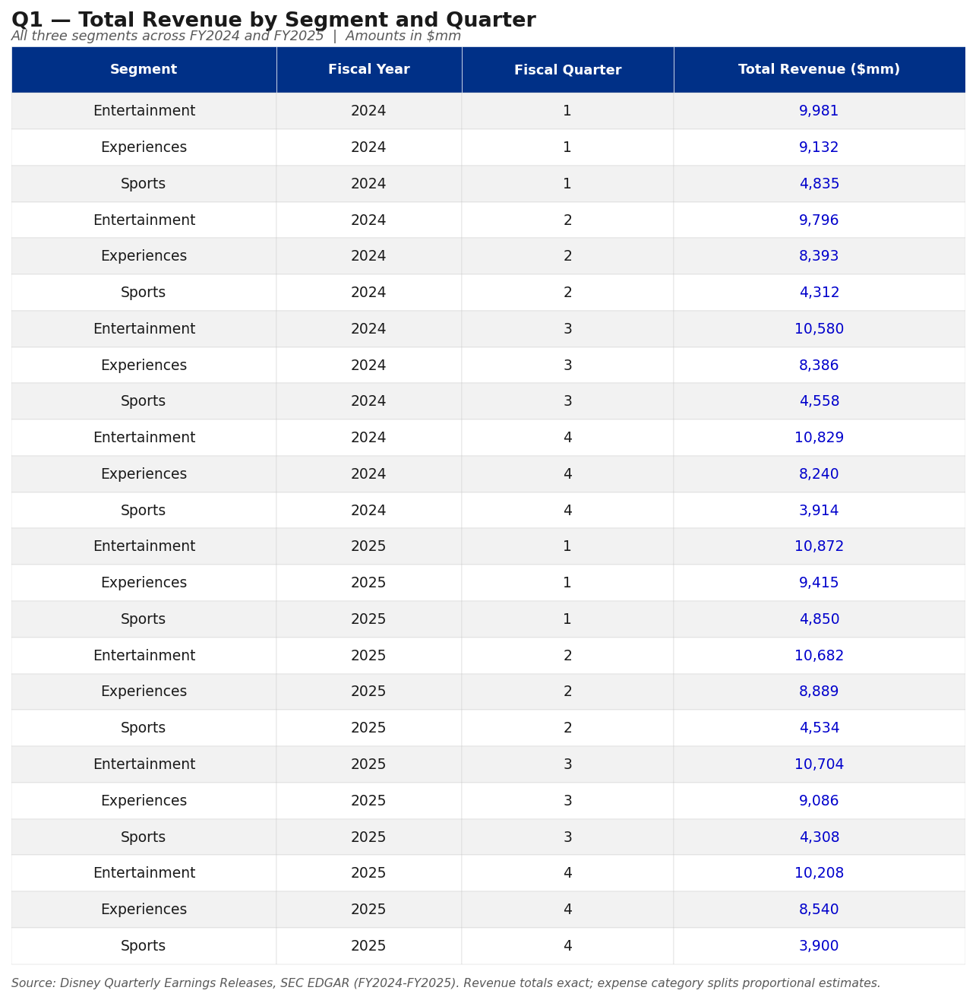
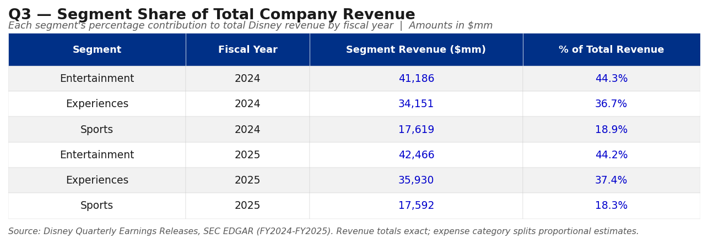

# Disney Segment Financial Reporting: SQL Project

This project applies SQL to real-world financial data by modeling Disney's segment reporting structure. Using publicly reported figures from Disney's SEC filings, I built a relational database and wrote queries that produce the kind of cross-segment analysis a financial analyst would pull on a recurring basis.

The data comes directly from Disney's quarterly earnings releases filed on SEC EDGAR, so the revenue figures are real. The expense category breakdowns are estimated based on the operating income margins Disney reported, since they don't break those out at the sub-category level publicly.

---

## What the database covers

Disney reports financials across three segments:

- **Entertainment**: Disney+, Hulu, ABC, Disney Channel, FX, and content licensing. Biggest revenue segment but thin margins because they're spending heavily on both streaming and linear TV at the same time
- **Sports**: ESPN, ESPN+, and related properties. Revenue is mostly affiliate fees from cable providers and advertising. Renamed from "ESPN" to "Sports" in FY2024
- **Experiences**: Theme parks, Disney Cruise Line, and consumer products. Highest margin segment by far and basically the profit engine of the whole company right now

The database covers FY2024 and FY2025 (Disney's fiscal year ends in late September), broken down by quarter.

---

## Database structure

Four tables connected by foreign keys:

| Table | What it holds |
|---|---|
| `segments` | The three business segments |
| `fiscal_periods` | Each quarter from FY2024 Q1 through FY2025 Q4 |
| `revenue` | Revenue by segment, quarter, and revenue type |
| `operating_expenses` | Expenses by segment, quarter, and category |

---

## Data sources

Revenue totals are pulled directly from Disney's SEC filings, the same documents their investor relations team releases on every earnings call:

| Filing | What I used it for |
|---|---|
| [FY2024 Q4 Earnings Release](https://www.sec.gov/Archives/edgar/data/1744489/000174448924000275/fy2024_q4xprxex991.htm) | Full year FY2024 actuals |
| [FY2025 Q2 Earnings Release](https://www.sec.gov/Archives/edgar/data/0001744489/000174448925000096/fy2025_q2xprxex991.htm) | Q1 and Q2 FY2025 actuals |
| [FY2025 Q3 Earnings Release](https://www.sec.gov/Archives/edgar/data/0001744489/000174448925000135/fy2025_q3xprxex991.htm) | Q3 FY2025 actuals |
| [FY2025 Q4 Earnings Release](https://www.sec.gov/Archives/edgar/data/1744489/000174448925000154/fy2025_q4xprxex991.htm) | Full year FY2025 actuals |

All Disney 10-K filings: [SEC EDGAR](https://www.sec.gov/cgi-bin/browse-edgar?action=getcompany&CIK=0001744489&type=10-K)

---

## Queries

I wrote six queries total. The first three are pretty standard: revenue rollups, operating income, and segment mix. The last three dig into things I was actually curious about after looking at the data.

**Q1: Revenue by segment and quarter**
Basic rollup. Good starting point for seeing how each segment trends across the two fiscal years.

**Q2: Annual operating income by segment**
Revenue minus total expenses per segment per year. Simple P&L summary.

**Q3: Each segment's share of total revenue**
Uses a window function to calculate what percentage of Disney's total revenue each segment represents annually.

**Q4: Entertainment linear vs. direct-to-consumer breakdown**
This one I found interesting. It breaks out how much of Entertainment revenue comes from linear TV vs. streaming vs. content licensing each quarter, and tracks DTC as a percentage over time.

**Q5: Experiences seasonality**
Parks revenue is heavily seasonal, so I wanted to see which quarter is consistently strongest and by how much.

**Q6: Operating margin by segment and year**
This ended up being the most interesting result. Calculates operating margin percentage for each segment so you can directly compare profitability across three very different business models.

---

## Query output previews







---

## What I found

**Experiences carries the company.** Entertainment is Disney's biggest segment at $42B+ in annual revenue, but it only runs at around a 10-11% operating margin. Experiences runs at nearly 12% on $35B in revenue and is growing. When you look at absolute operating income, the three segments are actually pretty close, which surprised me given how different their revenue bases are.

**Entertainment margins are stable but tight.** The 10-12% margin held consistent across both fiscal years. The reason is content costs. They're essentially funding two distribution systems (linear and streaming) simultaneously, which compresses margins significantly. Programming and production costs eat up the majority of the segment's expenses.

**DTC revenue in Entertainment plateaued in late FY2024.** Direct-to-Consumer grew as a share of Entertainment through most of FY2024, then leveled off and ticked down slightly through FY2025. A couple of things drove this: Disney+ hit subscriber saturation in major markets, they lost Disney+ Hotstar in the Star India transaction, and a strong theatrical slate in FY2024 Q4 (Inside Out 2, Deadpool & Wolverine) inflated Content Sales/Licensing, making DTC look smaller by comparison.

**Q1 is consistently the strongest quarter for Experiences.** The October-December window (holiday season, fall breaks) averages the highest park revenue across both years. Q4 (July-September) is the weakest, which I didn't expect given summer travel, but Disney's fiscal Q4 captures late July through September when summer winds down.

---

## How to run it

```bash
sqlite3 disney_segment_reporting.db < disney_segment_reporting.sql
sqlite3 disney_segment_reporting.db
```

Then before running any queries:
```sql
.mode column
.headers on
```

---

## Tools used

- SQLite3
- DB Browser for SQLite
- Excel (query results exported and formatted)

---

Robert Haldeman Jr,
B.A. Economics, Rowan University, May 2026
www.linkedin.com/in/roberthaldemanjr | haldemanrob@gmail.com
